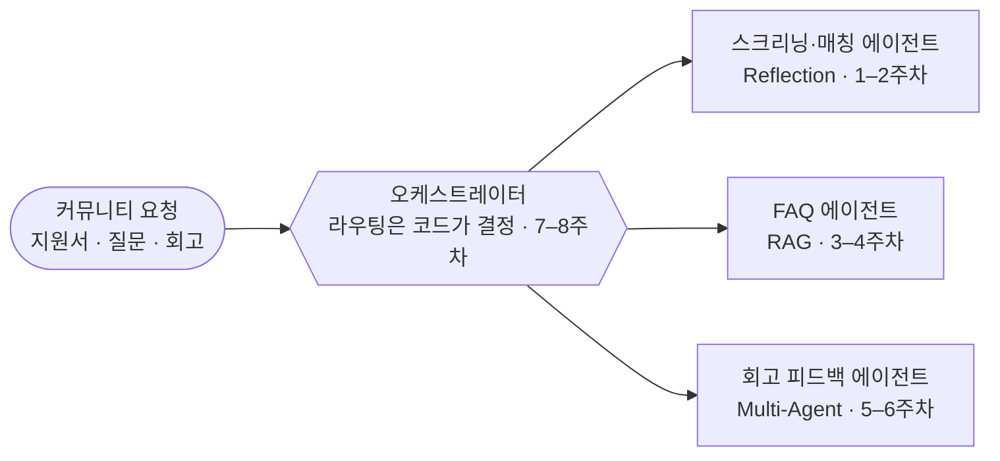

<!--
  agent-architecture-lab 조직 메인 페이지 — .github 레포의 profile/README.md
  매주 세션 후: logs/week-NN.md 의 「기록」을 채워요. 아래 표의 일지 링크는 이미 그 페이지를 가리켜요.
  일정·모듈이 바뀌면 이 표와 해당 주차 일지의 「계획」을 함께 고쳐요.
-->

# Agent Architecture Lab

**에이전트 아키텍처 랩** · 잇츠(IT's) 스터디 5기 · 2026.10 – 12

교재 속 에이전트 아키텍처를 읽는 데서 멈추지 않고, 
스터디 커뮤니티 운영에 실제로 쓰는 에이전트로 만들어 배포하는 8주 랩이에요.

정규 세션 **매주 목요일 19:30–21:30 (KST)** · [디스코드 서버](https://discord.gg/WF8cTKNUy) 100% 온라인

## 목적

에이전트를 데모가 아니라 **믿고 맡길 수 있는 도구**로 만드는 방법을 함께 익혀요.

- **패턴을 실전 문제에 적용해요** — 교재 [`all-agentic-architectures`](https://github.com/FareedKhan-dev/all-agentic-architectures)의 35개 아키텍처 가운데 Reflection · RAG · Multi-Agent 3패턴을 골라, 커뮤니티 운영 업무(지원서 스크리닝·매칭, FAQ 응대, 회고 피드백)를 돕는 에이전트로 구현해요.
- **최종 결정은 코드가 해요 (deterministic-picker)** — LLM은 범주형 판단(예/아니오, 등급, 카테고리)만 하고, 점수 합산·선발·라우팅 같은 최종 결정은 코드가 해요. 그래서 결과를 재현하고 검증할 수 있어요.
- **AI 코딩 에이전트와 GitHub로 협업해요** — Codex CLI로 교재를 읽고 구현하고, 모든 변경은 이슈 → 브랜치 → PR → 리뷰 → 머지로 남겨요. 원칙은 **읽기는 자유, 쓰기는 승인**.

## 목표

6주 동안 에이전트 3개를 2주씩 만들고, 마지막 2주에 하나의 오케스트레이터로 묶어요.

| 팀 목표 | 기준 |
| --- | --- |
| 아키텍처 구현 | **18개** (6명 × 3개) |
| 커밋 | **150개** 이상 |
| End-to-End 성공률 | **80%** 이상 |
| 완성도 | [가짜연구소 `Agent_is_all_you_need`](https://github.com/Pseudo-Lab/Agent_is_all_you_need) 동급 이상 |

**완주 기준** — 정규 세션 8회 중 6회 이상 출석 + 담당 트랙 1개 이상 배포

## 주차별 계획

예습 노트북은 교재의 [`notebooks/`](https://github.com/FareedKhan-dev/all-agentic-architectures/tree/HEAD/notebooks)에 있어요. 활동일지는 주차마다 한 페이지씩이고, 세션 전에 계획을, 세션 후에 기록을 채워요.

| 주차 | 날짜 | 모듈 | 패턴 | 예습 노트북 | 활동일지 |
| --- | --- | --- | --- | --- | --- |
| OT | 10/3(토) | 팀 오리엔테이션 — 환경설정 | — | [온보딩 가이드](https://github.com/agent-architecture-lab/aal-onboarding) | [일지](https://github.com/agent-architecture-lab/.github/blob/HEAD/logs/week-00.md) |
| 1주차 | 10/8(목) | 스크리닝·매칭 에이전트 착수 | Reflection | `01_reflection` | [일지](https://github.com/agent-architecture-lab/.github/blob/HEAD/logs/week-01.md) |
| 2주차 | 10/15(목) | 스크리닝·매칭 에이전트 완료 | Reflection | 심화 `18_reflexion` · `20_chain_of_verification` | [일지](https://github.com/agent-architecture-lab/.github/blob/HEAD/logs/week-02.md) |
| 3주차 | 10/22(목) | FAQ 에이전트 착수 | RAG | `23_agentic_rag` | [일지](https://github.com/agent-architecture-lab/.github/blob/HEAD/logs/week-03.md) |
| 4주차 | 10/29(목) | FAQ 에이전트 완료 | RAG | 심화 `24_corrective_rag` · `25_self_rag` · `26_adaptive_rag` | [일지](https://github.com/agent-architecture-lab/.github/blob/HEAD/logs/week-04.md) |
| 5주차 | 11/5(목) | 회고 피드백 에이전트 착수 | Multi-Agent | `05_multi_agent` | [일지](https://github.com/agent-architecture-lab/.github/blob/HEAD/logs/week-05.md) |
| 6주차 | 11/12(목) | 회고 피드백 에이전트 완료 | Multi-Agent | 심화 `07_blackboard` · `28_debate` | [일지](https://github.com/agent-architecture-lab/.github/blob/HEAD/logs/week-06.md) |
| 7주차 | 11/19(목) | 오케스트레이터 통합 설계 | 3패턴 통합 | `11_meta_controller` | [일지](https://github.com/agent-architecture-lab/.github/blob/HEAD/logs/week-07.md) |
| 8주차 | 11/26(목) | 오케스트레이터 통합 완료 + 리허설 | 3패턴 통합 | 앞 3패턴 복습 | [일지](https://github.com/agent-architecture-lab/.github/blob/HEAD/logs/week-08.md) |
| 성과공유회 | 12/16(수) | 최종 발표 | — | — | [기록](https://github.com/agent-architecture-lab/.github/blob/HEAD/logs/showcase.md) |

## 함께하기

1. [디스코드 서버](https://discord.gg/WF8cTKNUy)에 들어와요 — 공지·질문·정규 세션이 모두 여기서 이뤄져요.
2. [3-Day 온보딩 가이드](https://github.com/agent-architecture-lab/aal-onboarding)를 따라 Codex · GitHub · 교재 환경을 세팅해요.
3. [온보딩 체크리스트 이슈](https://github.com/agent-architecture-lab/aal-onboarding/issues/new?template=onboarding-checklist.md)를 열고 자기소개 PR(`crew/<GitHub ID>.md`)이 머지되면 준비 끝이에요.

**작업 방식**

- 과제·진행 상황은 **GitHub Issues + Projects 보드**로 관리해요.
- `main` 에 직접 push하지 않아요 — 브랜치 → PR → 리뷰 → 머지.
- 레포는 공개예요. 실습 데이터는 합성(가짜) 데이터만 쓰고, API 키는 `.env` 에만 둬요.

## 저장소

| 저장소 | 내용 |
| --- | --- |
| [`aal-onboarding`](https://github.com/agent-architecture-lab/aal-onboarding) | 3-Day 온보딩 가이드 · 점검 스크립트 · 크루 자기소개 |
| 실습 레포 | 10/3 팀 OT에서 공지 |
| `aal-skills` | 랩 공용 Codex 스킬·플러그인 (준비 중) |

문의 — 리더 Pio · <a href="https://discord.gg/WF8cTKNUy">디스코드 서버</a> · 이 페이지는 <a href="https://github.com/agent-architecture-lab/.github"><code>.github</code></a> 레포의 <code>profile/README.md</code> 예요

